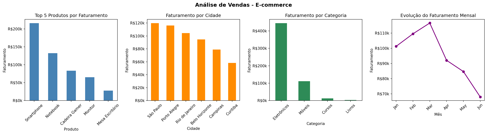

# 📊 Análise de Vendas com Python e Pandas

## Objetivo

Análise exploratória de dados de vendas de um e-commerce utilizando **Python**, **Pandas** e **Matplotlib**, com o objetivo de identificar padrões de faturamento, produtos mais lucrativos, cidades com maior volume de vendas e evolução mensal da receita.

---

## 🛠️ Tecnologias utilizadas

- Python 3
- Pandas
- Matplotlib

---

## 📁 Estrutura do projeto

```
projeto-analise-vendas/
│
├── vendas.csv
├── analise_vendas.py
├── dashboard_vendas.png
└── README.md
```

---

## ⚙️ Etapas da análise

1. **Carregamento dos dados**
   - Importação do dataset de vendas em formato CSV

2. **Tratamento e criação de métricas**
   - Criação da coluna `faturamento`:
     ```
     faturamento = preço × quantidade
     ```

3. **Análise multidimensional**
   - Faturamento por **produto**
   - Faturamento por **cidade**
   - Faturamento por **categoria**
   - Faturamento por **mês**

4. **Visualização**
   - Dashboard com 4 gráficos gerado e exportado automaticamente como imagem

---

## 📈 Dashboard



---

## 🔍 Principais insights

| Dimensão | Resultado |
|---|---|
| 💰 Faturamento total | R$ 572.109,86 |
| 🏆 Produto #1 | Smartphone — R$ 215.904,92 (37,7% do total) |
| 🥈 Produto #2 | Notebook — R$ 132.195,16 (23,1% do total) |
| 🏙️ Cidade líder | São Paulo — R$ 119.624,54 |
| 📦 Categoria dominante | Eletrônicos — R$ 444.265,65 (77,6% do total) |
| 📅 Melhor mês | Março — R$ 116.626,96 |

---

## ✅ Conclusão e Recomendações

### Conclusão

O e-commerce faturou **R$ 572.109,86** no período analisado (janeiro a junho). A receita é altamente concentrada: apenas **2 produtos** (Smartphone e Notebook) respondem por **60,8% do faturamento total**, e a categoria **Eletrônicos** representa **77,6%** de toda a receita.

A evolução mensal mostra crescimento consistente de janeiro a março, com queda a partir de abril — o mês de **junho registrou o menor faturamento** do período (R$ 67.949,99), representando uma redução de 42% em relação ao pico de março.

Geograficamente, **São Paulo e Porto Alegre** lideram as vendas, somando juntas 41,3% do faturamento total.

### Recomendações

- **Diversificar o portfólio:** a dependência de Eletrônicos expõe o negócio a riscos — investir em categorias com menor participação (Cursos e Livros somam apenas 2,9%) pode gerar novas fontes de receita.
- **Investigar a queda de abril a junho:** entender se é sazonalidade, problema de estoque ou redução de campanhas para agir de forma direcionada.
- **Reforçar ações em São Paulo e Porto Alegre:** as cidades líderes devem receber campanhas dedicadas para manter o volume.
- **Fone Bluetooth e Teclado têm potencial:** produtos com faturamento médio-baixo podem se beneficiar de promoções para aumentar volume de vendas.

---

## 📚 Aprendizados

- Manipulação de dados com **Pandas**
- Agrupamento com **groupby**
- Criação de métricas de negócio
- Manipulação de datas
- Visualização com **Matplotlib**
- Exportação de gráficos como imagem
- Extração e comunicação de insights para tomada de decisão

---

*Projeto desenvolvido como parte do processo de aprendizado em Análise de Dados com Python.*
